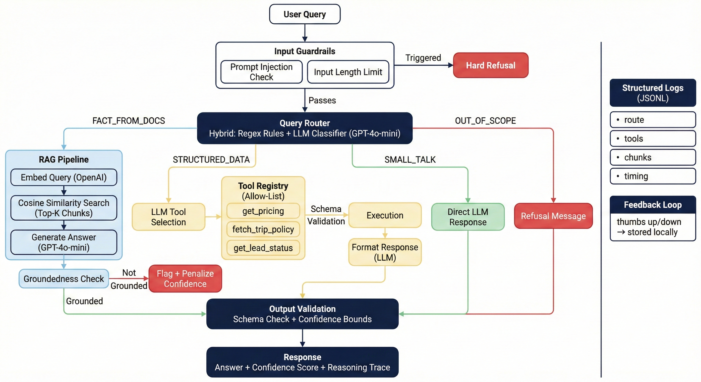

# Wanderon AI Assistant

The idea here is simple — not every query needs a vector search. If someone says "hi", don't embed it and scan a database. If someone asks for pricing, just call the pricing function. The assistant figures out _how_ to answer before it answers.

It routes each query into one of four lanes: doc retrieval (RAG), a tool/API call, a direct conversational reply, or a flat-out refusal. Every response comes back with a confidence score and a reasoning trace so you can see exactly what happened under the hood.

## Persistent Conversations

The assistant maintains conversation context across multiple messages. When a user says "my name is Pranav" and later asks "what's my name?", it remembers.

**How it works:** The backend stores message history per conversation in memory. Each response returns a `conversation_id`, and the frontend sends it back with the next message. Every handler — RAG, Tool calls, Small Talk — gets the full conversation history passed to `chat()`, so the LLM always has context.

The router is also conversation-aware. Without this, a follow-up like "what's my name?" would get classified as `OUT_OF_SCOPE` because it's not travel-related in isolation. With conversation history, the router sees the full context and routes it correctly as a conversational follow-up.

**Frontend:** There's a "New Chat" button in the header that resets `conversation_id` and starts a fresh conversation.

## Cost & Performance

A few deliberate choices to keep token usage and latency down:

- **Two-layer router** — regex catches greetings, refusals, and structured data patterns without making an API call. The LLM router only fires on ambiguous queries.
- **Single-pass RAG** — conversation history is passed directly into the RAG answer generation call, not as a separate re-generation step. One LLM call instead of two.
- **Confidence threshold early-exit** — if the best retrieved chunk scores below 0.55, the system returns "I don't know" immediately without calling the LLM at all.
- **Lazy initialization** — the OpenAI client and the embeddings store only load on first use, not on import.

## System Architecture



## Routing

The router is two layers. First layer is plain regex — it catches the obvious stuff without burning any tokens:

- Greetings like `hi`, `hello`, `how are you` get a direct LLM reply, no RAG involved
- Keywords like `stock market`, `medical advice`, `legal advice` get refused immediately
- Anything mentioning `price`, `cost`, `policy for`, `WDR-XXXX` goes to a tool call

If none of the patterns match, it falls back to GPT-4o-mini to classify the query into one of:

- `FACT_FROM_DOCS` — pull from the knowledge base
- `STRUCTURED_DATA` — call a tool
- `SMALL_TALK` — just reply directly
- `OUT_OF_SCOPE` — refuse politely

When there's an active conversation, the router gets the last few messages as context. This prevents it from misrouting follow-up questions — "tell me more" or "what about the cost?" make sense when the router can see what came before.

The reason for the two-layer thing is cost. A pure LLM router means you're paying for an API call on every single "thanks" and "bye". The regex layer handles those for free and the LLM only kicks in when the query is actually ambiguous.

## RAG Pipeline

When a query hits the `FACT_FROM_DOCS` route:

1. Embed the query with `text-embedding-3-small`
2. Run cosine similarity against pre-embedded doc chunks
3. If the best chunk scores below 0.55, bail out early — return "insufficient info" instead of making something up
4. Generate an answer using only the retrieved context (with conversation history if available)
5. Run a groundedness check — a second LLM call that verifies the answer is actually backed by the chunks
6. If it's not grounded, the response gets flagged and the confidence score takes a hit

### Why no ChromaDB / Pinecone / external vector DB?

The knowledge base is 4 documents, ~30 chunks total. Running a whole vector database service for that is unnecessary overhead. Instead, the vector store here is just OpenAI embeddings saved to a JSON file, with cosine similarity computed in a loop. It does the exact same thing ChromaDB does internally — turn text into numbers, compare those numbers — just without the extra infrastructure.

If the corpus grew to thousands of documents, swapping in ChromaDB or Pinecone would be straightforward since all the retrieval logic is behind one `retrieve()` function. But at this scale, keeping it simple made more sense than adding an external dependency for no real benefit.

The `data/docs/` folder has 4 documents I wrote covering Wanderon's company info, destinations, booking FAQs, and travel tips. In a real setup you'd swap these out with actual company data — the retrieval pipeline stays the same.

## Tool Calling

Three tools, all behind an allow-list:

| Tool                | What it does                 | Example                           |
| ------------------- | ---------------------------- | --------------------------------- |
| `get_pricing`       | Returns pricing by plan tier | "How much is the premium plan?"   |
| `fetch_trip_policy` | Policies for a destination   | "Cancellation policy for Ladakh?" |
| `get_lead_status`   | Booking status lookup        | "Status of WDR-1001"              |

The LLM picks which tool to call and with what args, but it can't call anything outside this list. Every tool has a strict schema — required fields, enum values, regex patterns for IDs. Args get validated before the function ever runs. If something doesn't match, it gets rejected with a clear error.

## Guardrails

These are all enforced in code, not through prompts:

| What                           | Where  | How                                                                                             |
| ------------------------------ | ------ | ----------------------------------------------------------------------------------------------- |
| Prompt injection detection     | Input  | Regex patterns for "ignore your instructions", "pretend you are", "reveal your prompt", etc.    |
| Input length cap               | Input  | Anything over 2000 chars gets rejected before it touches the LLM                                |
| Retrieval confidence threshold | RAG    | If the best chunk scores below 0.55, the system says "I don't know" instead of guessing         |
| Output schema check            | Output | Every response gets validated — required fields present, confidence between 0-1, route is valid |

## Logging

Every request gets a structured log entry — route picked, method used (rule vs LLM), tools called, chunks retrieved with scores, guardrails that fired, conversation ID, response time. Stored as JSONL, one file per day, in `data/logs/`.

You can pull recent logs from `GET /logs?count=20`.

## Feedback

Basic thumbs up / thumbs down on each response. Stored locally in `data/feedback.json`.

```bash
# thumbs up
curl -X POST http://localhost:3000/feedback \
  -H "Content-Type: application/json" \
  -d '{"request_id": "<id>", "rating": "positive"}'

# stats
curl http://localhost:3000/feedback/stats
```

**How feedback would improve the system** (not implemented, but the path is clear):
Where this would go next: negative feedback on RAG answers could flag bad query-chunk pairs for review. Negative feedback on routing could feed misrouted queries back as few-shot examples or new regex rules. Tracking satisfaction by route type would show which pipeline needs work first.

## What Can Go Wrong

| Problem                                         | What happens                                         |
| ----------------------------------------------- | ---------------------------------------------------- |
| LLM router returns unparseable JSON             | Falls back to OUT_OF_SCOPE                           |
| Router picks an invalid route                   | Validated against the list, defaults to OUT_OF_SCOPE |
| No relevant docs found                          | Confidence threshold blocks hallucinated answers     |
| Generated answer isn't backed by context        | Groundedness check catches it, flags the response    |
| Tool gets bad arguments                         | Schema validation rejects them before execution      |
| Someone tries to call a tool that doesn't exist | Allow-list blocks it                                 |
| Prompt injection attempt                        | Regex refusal rules catch common patterns            |
| Huge input                                      | Character limit kicks in before anything else runs   |
| OpenAI API goes down                            | Try-catch, returns 500 with request ID for debugging |

## Production Improvements

Things I'd change before shipping this for real users:

- **Conversation summarization** — right now the full message history is sent with every LLM call. After 20+ messages, that's expensive. In production, I'd summarize older messages into a condensed context block (e.g. "User is Pranav, interested in Ladakh, asked about premium plan") and keep only the last few messages verbatim. This keeps token costs flat while preserving all the context.
- **Persistent storage** — conversations are in-memory, so they're lost on restart. Swapping the store for Redis or a database would take minimal changes since the interface (`getMessages`, `addMessage`) stays the same.
- **User authentication** — tie conversations to user accounts so context carries across sessions and devices.

## Setup

```bash
# install deps
npm install

# set up env
cp .env.example .env
# add your OpenAI API key in .env

# embed the documents (one-time)
npm run ingest

# run it
npm start
# or with auto-reload for dev:
npm run dev
```

Then open `http://localhost:3000` — there's a chat UI with conversation support. Click "New Chat" to start a fresh conversation.

## Example Queries (or Use the HTML page to test.)

```bash
# travel question → RAG
curl -X POST http://localhost:3000/query -H "Content-Type: application/json" \
  -d '{"query": "What destinations does Wanderon offer in northeast India?"}'

# pricing → tool call
curl -X POST http://localhost:3000/query -H "Content-Type: application/json" \
  -d '{"query": "How much does the premium plan cost?"}'

# greeting → direct LLM (starts a conversation)
curl -X POST http://localhost:3000/query -H "Content-Type: application/json" \
  -d '{"query": "Hello, my name is Pranav"}'

# follow-up with conversation context
curl -X POST http://localhost:3000/query -H "Content-Type: application/json" \
  -d '{"query": "what is my name?", "conversationId": "<id from previous response>"}'

# out of scope → refusal
curl -X POST http://localhost:3000/query -H "Content-Type: application/json" \
  -d '{"query": "What stocks should I invest in?"}'
```

## Project Structure

```
src/
  index.js          — Express server, query endpoint, route handlers
  router.js         — Hybrid regex + LLM query classifier (conversation-aware)
  rag.js            — Retrieval + generation + groundedness checking
  llm.js            — OpenAI client wrapper (chat, embed)
  tools.js          — Tool definitions, schemas, execution
  guardrails.js     — Input/output validation rules
  logger.js         — Structured JSONL logging
  feedback.js       — Thumbs up/down tracking
  conversations.js  — In-memory conversation history management
  config.js         — Environment config
public/
  index.html        — Chat UI with conversation support
data/
  docs/             — Source documents for RAG
  embeddings.json   — Pre-computed embeddings
  logs/             — Daily JSONL log files
```

## Tech Stack

**Runtime**: Node.js + Express
**LLM**: OpenAI (GPT-4o-mini for routing/verification, GPT-4o-mini for answers)
**Embeddings**: OpenAI text-embedding-3-small
**Vector Store**: Custom in-process store (cosine similarity over pre-computed embeddings)
**Conversations**: In-memory message history (per-session)
**Logging**: JSONL files, one per day
**Feedback**: Local JSON file
